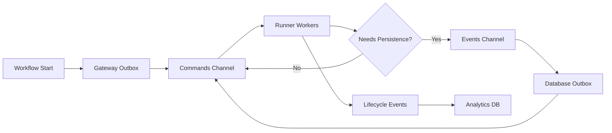
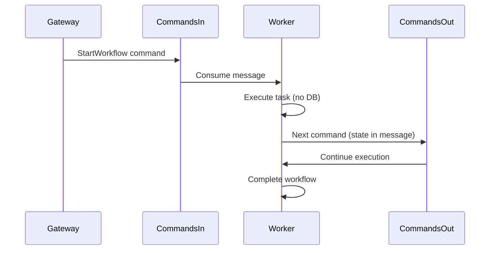
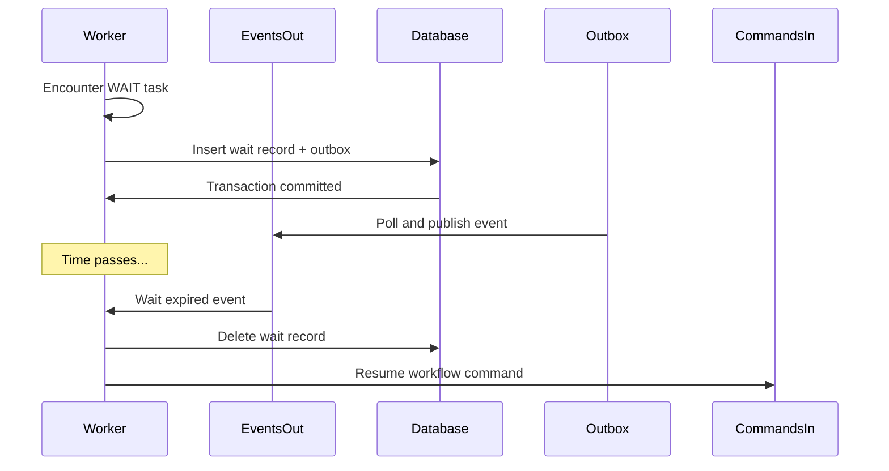

Lemline uses a dual-channel messaging architecture to achieve high throughput while maintaining reliability for critical operations.

## Dual-channel architecture

Lemline separates workflow processing into two channels:



### Commands channel (high-throughput)

- **Purpose**: Fast, stateless workflow execution
- **Topics**: `commands-in`, `commands-out`
- **Characteristics**:
  - State carried in messages (no database reads)
  - At-least-once delivery
  - High concurrency (100+ workers)
  - No durable storage required

### Events channel (durable operations)

- **Purpose**: Operations requiring database guarantees
- **Topic**: `events-out`
- **Characteristics**:
  - Database transactions with outbox pattern
  - Exactly-once processing semantics
  - Lower concurrency (10-20 workers)
  - Used for: retries, waits, forks, listeners, schedules

## Message structure

Internal messages use Protocol Buffers for efficient serialization:

### Workflow command message

```protobuf
message WorkflowCommand {
  string workflow_id = 1;
  string namespace = 2;
  string name = 3;
  string version = 4;
  bytes workflow_state = 5;  // Compressed state
  optional string input_json = 6;
}
```

### Workflow event message

```protobuf
message WorkflowEvent {
  string workflow_id = 1;
  string event_type = 2;  // RETRY, WAIT, FORK_BRANCH, etc.
  bytes payload = 3;      // Event-specific data
  int64 sequence = 4;
}
```

## State in messages

Lemline embeds workflow state directly in messages to avoid database lookups:

```kotlin
// State is compressed and serialized
val stateBytes = compress(serialize(workflowState))

// Message carries complete state
val command = WorkflowCommand(
    workflowId = "wf-123",
    workflowState = stateBytes,
    // ...
)
```

**Benefits**:
- Workers are stateless (any worker can process any message)
- No database reads during hot path execution
- Horizontal scaling with no coordination

**Trade-offs**:
- Message size increases with workflow complexity
- Compression mitigates size (typically 80%+ reduction)

## Outbox pattern

Critical operations use the outbox pattern for reliability:

<Steps>
  <Step title="Write to outbox table">
    Insert pending message into database outbox table within a transaction
    
    ```sql
    INSERT INTO lemline_retry_outbox (id, workflow_id, payload, status)
    VALUES (?, ?, ?, 'PENDING');
    ```
  </Step>
  
  <Step title="Commit transaction">
    Commit the database transaction (atomically persists state + outbox message)
  </Step>
  
  <Step title="Outbox processor polls">
    Scheduled job queries pending messages with `FOR UPDATE SKIP LOCKED`
    
    ```sql
    SELECT * FROM lemline_retry_outbox
    WHERE status = 'PENDING'
    ORDER BY created_at
    LIMIT 1000
    FOR UPDATE SKIP LOCKED;
    ```
  </Step>
  
  <Step title="Publish to broker">
    Send messages to the broker (Kafka, RabbitMQ, PGMQ)
  </Step>
  
  <Step title="Mark as sent">
    Update outbox status to `SENT` after broker confirms receipt
  </Step>
  
  <Step title="Cleanup old messages">
    Periodic job deletes sent messages older than retention period (default: 7 days)
  </Step>
</Steps>

## Message flow examples

### Fast path (commands only)



### Slow path (with database persistence)



## Configuration

### Kafka

```yaml
lemline:
  messaging:
    type: kafka
    kafka:
      brokers: localhost:9092
      topic: lemline             # Commands channel
      topic-dlq: lemline-dlq     # Dead letter queue
      group-id: lemline-workers
      lifecycleevents:
        topic: lemline-lifecycle # Analytics events
```

### RabbitMQ

```yaml
lemline:
  messaging:
    type: rabbitmq
    rabbitmq:
      hostname: localhost
      port: 5672
      queue: lemline-commands
      exchange: lemline-events
```

### PGMQ (PostgreSQL Message Queue)

```yaml
lemline:
  messaging:
    type: pgmq
    pgmq:
      host: localhost
      port: 5432
      database: lemline
```

## Scaling considerations

### Commands channel

- **Kafka**: Increase partitions for parallel consumption
  ```bash
  kafka-topics.sh --alter --topic lemline --partitions 32
  ```
  
- **RabbitMQ**: Increase worker count (competing consumers)
  ```yaml
  quarkus:
    rabbitmq:
      lemline-commands:
        max-incoming-internal-queue-size: 100
  ```

### Events channel

- **Outbox polling**: Tune batch size and interval
  ```yaml
  lemline:
    retry:
      outbox:
        every: "5s"        # Poll interval
        batch-size: 500    # Messages per batch
  ```

## Monitoring

Key metrics to monitor:

- **Commands channel lag**: Message backlog in `commands-in`
- **Outbox depth**: Pending messages in outbox tables
- **Processing rate**: Messages/second per worker
- **Error rate**: Failed message processing

```promql
# Commands channel lag (Kafka)
sum(kafka_consumer_lag{topic="lemline"}) by (partition)

# Outbox depth
sum(lemline_outbox_pending_total) by (outbox_type)

# Processing rate
rate(lemline_workflow_commands_processed_total[5m])
```

## Best practices

<AccordionGroup>
  <Accordion title="Use commands channel for hot path">
    Keep execution in the commands channel as long as possible. Only transition to events channel when database persistence is required (wait, retry, fork).
  </Accordion>
  
  <Accordion title="Compress workflow state">
    Lemline automatically compresses state before embedding in messages. Ensure compression is enabled for large workflows.
  </Accordion>
  
  <Accordion title="Monitor outbox lag">
    Set alerts for outbox depth exceeding thresholds. High outbox lag indicates database or broker issues.
  </Accordion>
  
  <Accordion title="Tune outbox polling">
    Adjust polling interval and batch size based on workload. Higher batch sizes improve throughput but increase latency.
  </Accordion>
</AccordionGroup>

## Next steps

<CardGroup cols={2}>
  <Card title="Protobuf schemas" icon="code" href="/api/internal/protobuf">
    Internal message schema reference
  </Card>
  <Card title="Outbox pattern" icon="database" href="/api/internal/outbox-pattern">
    Outbox implementation details
  </Card>
  <Card title="Messaging configuration" icon="gear" href="/configuration/messaging">
    Configure Kafka, RabbitMQ, PGMQ
  </Card>
  <Card title="Monitoring" icon="chart-line" href="/operations/monitoring">
    Monitor messaging performance
  </Card>
</CardGroup>
