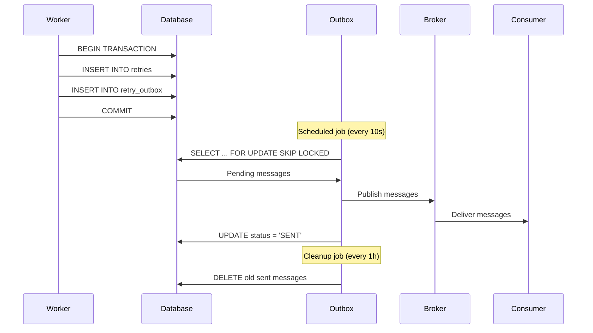

Lemline implements the **Transactional Outbox Pattern** to ensure reliable message delivery for critical workflow operations.

## Why the outbox pattern?

The outbox pattern solves the **dual-write problem**: ensuring both database changes and message publication succeed together.

### Without outbox (unreliable)

```kotlin
// ❌ Race condition: DB commit might succeed but message fails
db.execute("INSERT INTO retries ...")
broker.publish(retryMessage)  // What if this fails?
```

**Problems**:
- If broker fails, retry is persisted but never executed
- If database fails after publish, message is sent but state is lost
- No way to recover from partial failures

### With outbox (reliable)

```kotlin
// ✅ Atomic: Both writes succeed or both fail
db.transaction {
    execute("INSERT INTO retries ...")
    execute("INSERT INTO retry_outbox ...")
}  // Commit both together

// Separate process publishes from outbox
outboxProcessor.poll()
```

**Guarantees**:
- Database commit includes both state and outbox message
- If transaction fails, nothing is persisted or published
- Outbox processor ensures eventual delivery

## Architecture



## Outbox tables

Each Lemline module that requires reliable delivery has an outbox table:

### Retry outbox

```sql
CREATE TABLE lemline_retry_outbox (
    id VARCHAR(36) PRIMARY KEY,
    workflow_id VARCHAR(36) NOT NULL,
    payload BYTEA NOT NULL,  -- Protobuf-encoded message
    status VARCHAR(20) NOT NULL,  -- PENDING, SENT, FAILED
    created_at TIMESTAMP NOT NULL,
    sent_at TIMESTAMP,
    attempts INT DEFAULT 0,
    INDEX idx_retry_outbox_status (status, created_at)
);
```

### Wait outbox

```sql
CREATE TABLE lemline_wait_outbox (
    id VARCHAR(36) PRIMARY KEY,
    workflow_id VARCHAR(36) NOT NULL,
    target_time TIMESTAMP NOT NULL,  -- When to resume
    payload BYTEA NOT NULL,
    status VARCHAR(20) NOT NULL,
    created_at TIMESTAMP NOT NULL,
    INDEX idx_wait_outbox_target_time (target_time, status)
);
```

### Fork outbox

```sql
CREATE TABLE lemline_fork_outbox (
    id VARCHAR(36) PRIMARY KEY,
    workflow_id VARCHAR(36) NOT NULL,
    branch_id VARCHAR(36) NOT NULL,
    payload BYTEA NOT NULL,
    status VARCHAR(20) NOT NULL,
    created_at TIMESTAMP NOT NULL,
    INDEX idx_fork_outbox_status (status, created_at)
);
```

## Outbox processor

Each outbox has a scheduled processor that polls for pending messages:

```kotlin
@Scheduled(every = "{lemline.retry.outbox.every}")
suspend fun processRetryOutbox() {
    val batchSize = config.retry.outbox.batchSize
    
    // Use FOR UPDATE SKIP LOCKED for parallel workers
    val messages = retryOutboxRepository.findPending(
        limit = batchSize,
        forUpdate = true
    )
    
    messages.forEach { outboxMessage ->
        try {
            // Publish to broker
            messagingService.publish(
                topic = "commands-in",
                message = outboxMessage.payload
            )
            
            // Mark as sent
            retryOutboxRepository.markSent(outboxMessage.id)
        } catch (e: Exception) {
            // Increment attempts, will retry on next poll
            retryOutboxRepository.incrementAttempts(outboxMessage.id)
        }
    }
}
```

## FOR UPDATE SKIP LOCKED

Lemline uses `FOR UPDATE SKIP LOCKED` to enable parallel outbox processing:

```sql
SELECT * FROM lemline_retry_outbox
WHERE status = 'PENDING'
ORDER BY created_at
LIMIT 1000
FOR UPDATE SKIP LOCKED;  -- Skip rows locked by other workers
```

**Benefits**:
- Multiple workers can process the same outbox concurrently
- No lock contention between workers
- Workers automatically partition work

**Example with 3 workers**:
- Worker 1 locks rows 1-1000
- Worker 2 locks rows 1001-2000 (skips locked rows)
- Worker 3 locks rows 2001-3000

## Configuration

Outbox processors are configured per module:

```yaml .lemline.yaml
lemline:
  retry:
    outbox:
      every: "10s"          # Poll interval
      batch-size: 1000      # Messages per batch
      initial-jitter: "3s"  # Random startup delay
      retry-delay: "30s"    # Backoff between retries
      max-attempts: 5       # Max publish attempts
    cleanup:
      every: "1h"           # Cleanup interval
      after: "7d"           # Delete after 7 days
      batch-size: 1000

  wait:
    outbox:
      every: "10s"
      batch-size: 1000
    cleanup:
      every: "1h"
      after: "7d"
```

### Parameters

<ParamField path="outbox.every" type="duration" default="10s">
  How often the outbox processor polls for pending messages
</ParamField>

<ParamField path="outbox.batch-size" type="number" default="1000">
  Maximum messages to process per poll
</ParamField>

<ParamField path="outbox.initial-jitter" type="duration" default="3s">
  Random delay (0 to this value) before first poll to avoid thundering herd
</ParamField>

<ParamField path="outbox.retry-delay" type="duration" default="30s">
  Base delay for exponential backoff on failed publish attempts
</ParamField>

<ParamField path="outbox.max-attempts" type="number" default="5">
  Maximum publish attempts before marking message as FAILED
</ParamField>

<ParamField path="cleanup.every" type="duration" default="1h">
  How often to clean up old sent messages
</ParamField>

<ParamField path="cleanup.after" type="duration" default="7d">
  Delete sent messages older than this duration
</ParamField>

## Delivery guarantees

### At-least-once delivery

The outbox pattern provides **at-least-once delivery**:

- Messages are always delivered to the broker
- Messages may be delivered multiple times if:
  - Broker confirms receipt but outbox update fails
  - Worker crashes after publish but before marking as sent

**Idempotency**: Workflow processing is idempotent, so duplicate messages are safe.

### Ordering

Messages are processed in **approximate order**:

- Within a single worker: strict order by `created_at`
- Across multiple workers: eventual ordering (no strict guarantee)

**When order matters**: Use workflow-level sequencing (e.g., task indexes in `do` blocks).

## Monitoring

Monitor outbox health with these metrics:

### Outbox depth

```promql
# Pending messages in each outbox
sum(lemline_outbox_pending_total) by (outbox_type)
```

### Processing rate

```promql
# Messages processed per second
rate(lemline_outbox_processed_total[5m]) by (outbox_type)
```

### Publish failures

```promql
# Failed publish attempts
rate(lemline_outbox_failed_total[5m]) by (outbox_type)
```

### Lag (age of oldest message)

```promql
# Age of oldest pending message
time() - min(lemline_outbox_oldest_pending_timestamp) by (outbox_type)
```

## Troubleshooting

<AccordionGroup>
  <Accordion title="Outbox depth growing">
    **Symptoms**: `lemline_outbox_pending_total` increasing over time
    
    **Causes**:
    1. Broker is slow or unavailable
    2. Batch size too small for high throughput
    3. Insufficient workers
    
    **Solutions**:
    - Increase `batch-size` (e.g., from 1000 to 5000)
    - Decrease `every` interval (e.g., from 10s to 5s)
    - Scale up worker count
    - Check broker health and capacity
  </Accordion>
  
  <Accordion title="Duplicate message processing">
    **Symptoms**: Workflows execute tasks multiple times
    
    **Causes**:
    1. Outbox processor crashes after publish but before marking sent
    2. Broker redelivers messages
    
    **Solutions**:
    - Ensure workflow logic is idempotent
    - Use workflow IDs for deduplication
    - Check worker logs for crashes during outbox processing
  </Accordion>
  
  <Accordion title="Messages stuck in PENDING">
    **Symptoms**: Messages remain PENDING despite processor running
    
    **Causes**:
    1. Serialization errors (invalid protobuf)
    2. Broker authentication failures
    3. Outbox processor not running
    
    **Solutions**:
    - Check worker logs for errors
    - Verify broker credentials
    - Ensure Quarkus scheduler is enabled
    - Query database for error details:
      ```sql
      SELECT * FROM lemline_retry_outbox
      WHERE status = 'PENDING'
      AND attempts > 0
      ORDER BY created_at;
      ```
  </Accordion>
</AccordionGroup>

## Best practices

<CardGroup cols={2}>
  <Card title="Tune batch size" icon="sliders">
    Balance latency vs throughput. Larger batches improve throughput but increase latency.
  </Card>
  <Card title="Monitor outbox depth" icon="chart-line">
    Set alerts for outbox depth exceeding normal levels
  </Card>
  <Card title="Enable cleanup" icon="broom">
    Prevent unbounded growth by regularly cleaning old sent messages
  </Card>
  <Card title="Test failure scenarios" icon="flask">
    Simulate broker failures to verify outbox behavior
  </Card>
</CardGroup>

## Next steps

<CardGroup cols={2}>
  <Card title="Messaging architecture" icon="network-wired" href="/api/internal/messaging">
    Learn about dual-channel messaging
  </Card>
  <Card title="Database configuration" icon="database" href="/configuration/database">
    Configure PostgreSQL, MySQL, or H2
  </Card>
  <Card title="Monitoring" icon="chart-line" href="/operations/monitoring">
    Set up metrics and alerts
  </Card>
  <Card title="Troubleshooting" icon="wrench" href="/operations/troubleshooting">
    Common issues and solutions
  </Card>
</CardGroup>
