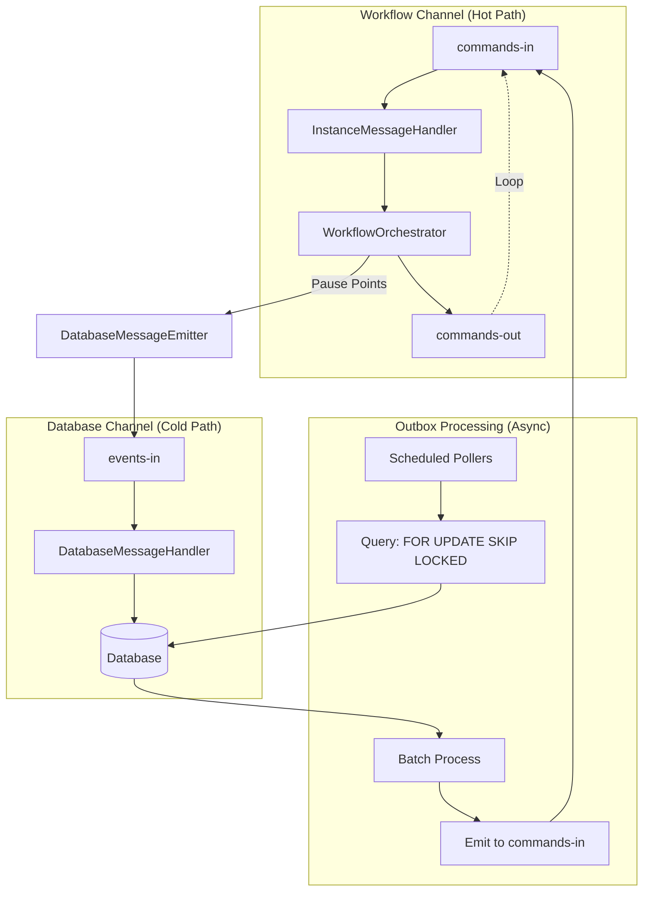

## Overview

Lemline is an event-driven workflow orchestration runtime implementing the [Serverless Workflow DSL v1.0](https://github.com/serverlessworkflow/specification) specification. The system is built on a modular architecture that separates workflow logic from infrastructure concerns.

<Note>
Lemline's architecture is designed for horizontal scalability with stateless workers and message-driven execution.
</Note>

## Architecture Modules

Lemline is organized into four main modules, each with clear responsibilities:

### lemline-core

The workflow execution engine that implements the Serverless Workflow DSL itself.

<Card title="Core Responsibilities" icon="gear">
- Workflow definition parsing and validation
- Task execution logic and state management
- Expression evaluation using JQ
- Error handling and retry mechanisms
</Card>

**Key characteristics**:
- Pure functional model with external state
- Exception-driven control flow for pause points
- Position-based navigation for stateless execution
- Implements all 12 official task types from the specification

### lemline-runner

The distributed execution runtime that provides infrastructure for the orchestrator.

<Card title="Runner Responsibilities" icon="server">
- Message broker integration (Kafka, RabbitMQ)
- Database persistence using PostgreSQL, MySQL, or H2
- Pause point handling (wait, retry, child workflows)
- Horizontal scaling with stateless workers
</Card>

**Key characteristics**:
- Stateless workers - any worker can process any message
- Event-driven architecture using SmallRye Reactive Messaging
- Outbox pattern for reliable database operations
- Quarkus-based reactive runtime

### lemline-common

Shared utilities and common functionality used across modules.

- UUID v7 ID generation (time-ordered)
- JSON serialization/deserialization
- Logging infrastructure
- Shared domain models

### lemline-docs

Documentation site (this site) built with Mintlify.

## Dual-Channel Architecture

Lemline uses a dual-channel message architecture to separate concerns between execution and persistence.

<Tabs>
  <Tab title="Workflow Channel">
    **Purpose**: High-throughput, stateless workflow execution
    
    - **Channel**: `commands-in` → `commands-out`
    - **Message Type**: `InstanceMessage` (compressed workflow state)
    - **Processing**: Fast, in-memory execution of workflow steps
    - **Database**: No writes - pure message transformation
    - **Latency**: ~milliseconds
    - **Throughput**: Very high (10,000+ msg/s)
    
    This is the "hot path" where active workflows execute without database I/O.
  </Tab>
  
  <Tab title="Database Channel">
    **Purpose**: Durable operations requiring transactional guarantees
    
    - **Channel**: `events-in` → Database
    - **Message Type**: `IngestionMessage` or `CompletedMessage`
    - **Processing**: Transactional database writes
    - **Use Cases**: Timers (wait), retries, parent-child tracking, failures
    - **Latency**: ~tens of milliseconds
    - **Throughput**: Lower (100s msg/s)
    
    This is the "cold path" for operations that require persistence.
  </Tab>
</Tabs>



<Info>
**Why separate channels?**

- Workflow execution never blocked by database latency
- Database writes batched and processed asynchronously
- System remains responsive during database degradation
- Clear separation: execution vs. persistence
</Info>

## State Carried in Messages

Following the Serverless Workflow specification's stateless execution model, workflow state is externalized and carried in messages.

### InstanceMessage Structure

```kotlin
data class InstanceMessage(
    val workflowInfo: WorkflowInfo,        // namespace, name, version, id
    val workflowState: WorkflowState,      // Execution state (sealed class)
    val parentId: IDV7? = null             // Parent reference for child workflows
)
```

### WorkflowState Variants

<AccordionGroup>
  <Accordion title="Starting" icon="flag">
    Workflow just started with initial input.
    
    ```kotlin
    data class Starting(
        val startedAt: Instant,
        val input: JsonElement
    )
    ```
  </Accordion>
  
  <Accordion title="ReadyForNextTask" icon="play">
    Ready to execute the next task (intermediate state).
    
    ```kotlin
    data class ReadyForNextTask(
        val taskStates: TaskStates,
        val nodePosition: NodePosition,
        val rawInput: JsonElement
    )
    ```
  </Accordion>
  
  <Accordion title="Waiting" icon="clock">
    Paused for time delay (wait task).
    
    ```kotlin
    data class Waiting(
        val waitUntil: Instant,
        ...
    )
    ```
  </Accordion>
  
  <Accordion title="Retrying" icon="rotate">
    Scheduled for retry after failure.
    
    ```kotlin
    data class Retrying(
        val retryAt: Instant,
        ...
    )
    ```
  </Accordion>
  
  <Accordion title="RunningChildWorkflow" icon="diagram-nested">
    Parent workflow paused while child executes.
    
    ```kotlin
    data class RunningChildWorkflow(
        val childConfig: Config,
        ...
    )
    ```
  </Accordion>
  
  <Accordion title="Completed" icon="check">
    Workflow completed successfully (terminal state).
    
    ```kotlin
    data class Completed(
        val output: JsonElement
    )
    ```
  </Accordion>
  
  <Accordion title="Failed" icon="xmark">
    Workflow failed with unhandled error (terminal state).
    
    ```kotlin
    data class Failed(
        val error: Error,
        ...
    )
    ```
  </Accordion>
</AccordionGroup>

<Check>
**Benefits of state-in-message**:
- Any worker can resume any workflow (no session affinity)
- Workflow state compressed and serialized in single message
- Database only stores pauses - active workflows live in message flow
- Natural backpressure via message broker
</Check>

## Node Position System

Lemline uses a unique position-based addressing system to identify nodes in the workflow tree.

### Position Structure

```kotlin
typealias NodePosition = List<Any>  // Mix of tokens, indices, names
```

**Components**:
1. **Tokens**: Structural markers (DO, TRY, CATCH, FORK, BRANCHES)
2. **Integer indices**: Child position (0-based)
3. **Task names**: Actual task name from DSL

### Position Examples

<CodeGroup>

```kotlin Root DO
[do]
```

```kotlin First Task
[do, 0, "validateInput"]
```

```kotlin Nested in TRY Block
[do, 1, "callAPI", try, do, 0, "httpCall"]
```

```kotlin Parallel Branch
[do, 2, "parallel", fork, branches, 0, "branch1"]
```

</CodeGroup>

<Warning>
Positions must be unique and deterministic across workflow executions to ensure proper state management and resumption.
</Warning>

## Outbox Pattern for Reliability

Lemline implements the Transactional Outbox Pattern for all database writes to ensure reliable message delivery.

### Outbox Processing Flow

1. Write to outbox table with `status=PENDING`
2. Commit transaction
3. Scheduled poller queries: `FOR UPDATE SKIP LOCKED`
4. Process batch concurrently
5. Update `status=SENT` on success
6. Exponential backoff on failure
7. Cleanup old SENT records

### Outbox Tables

<CardGroup cols={2}>
  <Card title="lemline_waits" icon="clock">
    Timer delays (wait tasks)
  </Card>
  <Card title="lemline_retries" icon="rotate">
    Error retries with backoff
  </Card>
  <Card title="lemline_parents" icon="diagram-nested">
    Parent-child workflow coordination
  </Card>
  <Card title="lemline_schedules" icon="calendar">
    Scheduled workflow execution
  </Card>
  <Card title="lemline_failures" icon="triangle-exclamation">
    Terminal failure records
  </Card>
</CardGroup>

### Outbox SQL Pattern

```sql
SELECT * FROM lemline_waits
WHERE outbox_status = 'PENDING'
  AND outbox_scheduled_for <= NOW()
  AND outbox_attempt_count < :maxAttempts
ORDER BY outbox_scheduled_for
FOR UPDATE SKIP LOCKED
LIMIT :batchSize
```

<Info>
`FOR UPDATE SKIP LOCKED` prevents multiple workers from processing the same outbox record, enabling safe concurrent processing.
</Info>

## Technology Stack

<CardGroup cols={2}>
  <Card title="Kotlin" icon="k">
    2.2.10 - Primary language with coroutines for async flows
  </Card>
  <Card title="Java" icon="java">
    17 - Runtime platform
  </Card>
  <Card title="Quarkus" icon="cube">
    3.x - Reactive, lightweight runtime
  </Card>
  <Card title="SmallRye Reactive Messaging" icon="message">
    Kafka/RabbitMQ integration with backpressure
  </Card>
  <Card title="PostgreSQL / MySQL / H2" icon="database">
    Multi-database support with native SQL
  </Card>
  <Card title="Flyway" icon="feather">
    Database schema migrations
  </Card>
  <Card title="JQ" icon="code">
    Expression evaluation engine
  </Card>
  <Card title="Mutiny" icon="infinity">
    Reactive programming library
  </Card>
</CardGroup>

## Scaling Model

Lemline's architecture supports horizontal scaling at multiple levels:

### Worker Scaling

<Steps>
  <Step title="Add Workers">
    Deploy additional runner instances - no coordination needed
  </Step>
  <Step title="Partition Load">
    Message broker automatically distributes messages across workers
  </Step>
  <Step title="Process Concurrently">
    Each worker processes messages independently
  </Step>
  <Step title="Database Locking">
    `FOR UPDATE SKIP LOCKED` prevents duplicate processing
  </Step>
</Steps>

### Database Scaling

- Read replicas for workflow definition lookups
- Write scaling via sharding (future enhancement)
- Connection pooling with Agroal

### Message Broker Scaling

- Kafka partitioning for parallel consumption
- RabbitMQ queue sharding
- In-memory mode for testing/development

## Next Steps

<CardGroup cols={2}>
  <Card title="Workflow DSL" icon="file-code" href="/concepts/workflow-dsl">
    Learn about the Serverless Workflow DSL implementation
  </Card>
  <Card title="Event-Driven Orchestration" icon="bolt" href="/concepts/event-driven-orchestration">
    Understand event-driven architecture details
  </Card>
  <Card title="State Management" icon="database" href="/concepts/state-management">
    Explore workflow state management approach
  </Card>
  <Card title="Error Handling" icon="triangle-exclamation" href="/concepts/error-handling">
    Discover error handling and retry mechanisms
  </Card>
</CardGroup>
