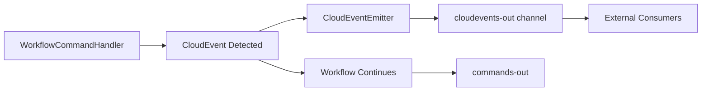

## Overview

Lemline provides powerful event-driven orchestration capabilities through two complementary task types:

<CardGroup cols={2}>
  <Card title="LISTEN" icon="ear-listen">
    Wait for and react to external events
    
    Enables workflows to pause and resume based on external triggers
  </Card>
  <Card title="EMIT" icon="tower-broadcast">
    Publish CloudEvents to external systems
    
    Broadcast business events for downstream consumers
  </Card>
</CardGroup>

<Info>
Both tasks use the [CloudEvents](https://cloudevents.io/) v1.0 specification for standardized event format and interoperability.
</Info>

## Listen Task

The `listen` task enables workflows to await and react to external events, creating event-driven behavior within workflow orchestration.

### Basic Syntax

```yaml
do:
  - taskName:
      listen:
        to:
          <consumption-strategy>
        read: data | envelope | raw  # optional, defaults to 'data'
      foreach:  # optional
        item: <variable-name>
        do:
          - <nested-tasks>
```

### Event Consumption Strategies

The `listen.to` property defines which events the task waits for.

<Tabs>
  <Tab title="one">
    **Wait for a single event** matching the specified filter.
    
    ```yaml
    listen:
      to:
        one:
          with:
            type: com.example.order.created
    ```
    
    **Completion**: When one matching event is received.
    
    **Output**: Array containing one element (the event data).
  </Tab>
  
  <Tab title="any">
    **Wait for any matching event** from multiple filters.
    
    ```yaml
    listen:
      to:
        any:
          - with:
              type: com.example.order.created
          - with:
              type: com.example.order.updated
    ```
    
    **Completion**: When the first event matching any filter is received.
    
    **Output**: Array containing one element (the first matching event data).
    
    <Note>
    Empty `any: []` means "listen to any event regardless of type" - completes on the very first event received.
    </Note>
  </Tab>
  
  <Tab title="all">
    **Wait for all specified events** - one event matching each filter.
    
    ```yaml
    listen:
      to:
        all:
          - with:
              type: com.example.payment.received
          - with:
              type: com.example.inventory.reserved
    ```
    
    **Completion**: When one event per filter has been received (order doesn't matter).
    
    **Output**: Array containing one element per filter (e.g., 2 filters = 2 events in output).
  </Tab>
</Tabs>

### Event Filtering

Each filter uses the `with` property to match CloudEvent attributes:

```yaml
with:
  type: <string>              # Exact string match only
  source: <uri|expression>    # URI or runtime expression
  subject: <string>           # Exact string match only
  id: <string>                # Exact string match only
  datacontenttype: <string>   # Exact string match only
  dataschema: <uri|expression> # URI or runtime expression
  time: <datetime|expression> # Datetime or runtime expression
  data: <expression>          # Runtime expression (see below)
```

#### Expression Support by Property

<ResponseField name="Properties" type="object">
  <Expandable title="id" type="string">
    **Supports Expression**: ❌ No
    
    **Match Type**: Exact string match
  </Expandable>
  
  <Expandable title="type" type="string">
    **Supports Expression**: ❌ No
    
    **Match Type**: Exact string match
  </Expandable>
  
  <Expandable title="subject" type="string">
    **Supports Expression**: ❌ No
    
    **Match Type**: Exact string match
  </Expandable>
  
  <Expandable title="datacontenttype" type="string">
    **Supports Expression**: ❌ No
    
    **Match Type**: Exact string match
  </Expandable>
  
  <Expandable title="source" type="uri">
    **Supports Expression**: ✅ Yes
    
    **Evaluated Against**: The `source` URI value
    
    ```yaml
    source: ${ . | startswith("https://example.com") }
    ```
  </Expandable>
  
  <Expandable title="dataschema" type="uri">
    **Supports Expression**: ✅ Yes
    
    **Evaluated Against**: The `dataschema` URI value
  </Expandable>
  
  <Expandable title="time" type="datetime">
    **Supports Expression**: ✅ Yes
    
    **Evaluated Against**: The `time` timestamp value
    
    ```yaml
    time: ${ . > "2024-01-01T00:00:00Z" }
    ```
  </Expandable>
  
  <Expandable title="data" type="object">
    **Supports Expression**: ✅ Yes
    
    **Evaluated Against**: The event's **data payload**
    
    ```yaml
    data: ${ .temperature > 38 }
    ```
  </Expandable>
</ResponseField>

### Filtering on Event Data

The `data` property accepts a runtime expression evaluated against the event's data payload. The expression must return a boolean:

```yaml
listen:
  to:
    one:
      with:
        type: com.hospital.vitals.temperature
        data: ${ .temperature > 38 }
```

<Warning>
**Expression Context for `data`**:

- `.temperature` refers to the `temperature` field in the event's data payload
- Only events where `data.temperature > 38` will match
- **No access** to workflow context (`$input`, `$context`, `$workflow`, `$task`)
- To filter based on workflow data, use `correlate` (see below)
</Warning>

### Event Correlation

<Warning>
**Implementation Status**: The `correlate` keyword is **NOT YET IMPLEMENTED**.

Type definitions exist, but the runtime currently ignores this property. All workflow instances listening for the same event type receive all matching events (broadcast semantics).
</Warning>

The `correlate` property enables instance-specific event routing, ensuring events are delivered only to the workflow instance that expects them.

#### Why Correlation Matters

Without correlation, events are broadcast to all workflow instances:

```
Instance A (orderId: "123"): listening for type=order.shipped
Instance B (orderId: "456"): listening for type=order.shipped

Event arrives: type=order.shipped, data.orderId="456"

Without correlation:
→ Instance A receives the event ❌ (wrong order!)
→ Instance B receives the event ✓

With correlation:
→ Instance A ignores the event ✓ (orderId doesn't match)
→ Instance B receives the event ✓ (orderId matches)
```

#### Correlation Syntax

```yaml
listen:
  to:
    one:
      with:
        type: <event-type>
      correlate:
        <correlation-key>:
          from: <expression>    # Required: extract value from event
          expect: <expression>  # Optional: expected value from workflow context
```

**Properties**:

| Property | Required | Description | Expression Context |
|----------|----------|-------------|-------------------|
| `from` | Yes | Extract correlation value from incoming event | **CloudEvent payload** (`.` = event data) |
| `expect` | No | Expected value. If not set, first extracted value becomes expectation. | **Workflow context** (`$input`, `$context`, etc.) |

<Info>
**Key Difference**: `correlate.expect` is the ONLY place where you can reference workflow-specific data to filter events.

```yaml
correlate:
  orderId:
    from: '${ .orderId }'         # Evaluated against EVENT
    expect: '${ $input.orderId }' # Evaluated against WORKFLOW
```
</Info>

#### Correlation Examples

<CodeGroup>

```yaml Basic Correlation
do:
  - waitForShipment:
      listen:
        to:
          one:
            with:
              type: order.shipped
            correlate:
              orderId:
                from: '${ .orderId }'           # Extract orderId from event data
                expect: '${ $input.orderId }'   # Match against workflow input
```

```yaml Multiple Correlation Keys
listen:
  to:
    one:
      with:
        type: payment.completed
      correlate:
        orderId:
          from: '${ .orderId }'
          expect: '${ $context.orderId }'
        customerId:
          from: '${ .customerId }'
          expect: '${ $context.customerId }'
```

```yaml Auto-Correlation (No expect)
listen:
  to:
    all:
      - with:
          type: order.created
        correlate:
          orderId:
            from: '${ .orderId }'
            # No expect: first event's orderId becomes the correlation value
      - with:
          type: order.paid
        correlate:
          orderId:
            from: '${ .orderId }'
            # Must match the orderId from the first event
```

</CodeGroup>

### Accumulation Mode with `until`

By default, `any` completes on the first matching event. The `until` clause changes this to **accumulate events** until a termination condition is met.

<Tabs>
  <Tab title="Terminate on Expression">
    ```yaml
    listen:
      to:
        any:
          - with:
              type: com.hospital.vitals.temperature
        until: . | any(.temperature > 38)
    ```
    
    Events accumulate until the expression evaluates to `true` on the collected array.
  </Tab>
  
  <Tab title="Terminate on Event">
    ```yaml
    listen:
      to:
        any:
          - with:
              type: com.hospital.vitals.temperature
          - with:
              type: com.hospital.vitals.bpm
        until:
          one:
            with:
              type: com.hospital.patient.checked-out
    ```
    
    **Behavior**:
    1. Accumulate all matching temperature and bpm events
    2. When `patient.checked-out` event arrives, stop listening
    3. Return all accumulated events
  </Tab>
</Tabs>

**Timeline Example**:
```
t=0   listen starts
t=2   temperature event (temp=37) → added to array
t=5   bpm event (bpm=120) → added to array
t=7   temperature event (temp=39) → added to array
t=10  patient.checked-out event → STOP

Output: [
  { "temperature": 37, ... },
  { "bpm": 120, ... },
  { "temperature": 39, ... }
]
```

### Processing Events with `foreach`

Execute nested tasks for each event as it arrives:

```yaml
listen:
  to:
    any:
      - with:
          type: com.hospital.vitals.temperature
    until: . | any(.temperature > 38)
  foreach:
    item: event
    at: index      # optional: current index
    do:
      - logMeasurement:
          set:
            temperature: ${ $event.temperature }
            timestamp: ${ now }
```

<Note>
Nested tasks are executed **as events arrive**, not after all events are collected.
</Note>

## Emit Task

The `emit` task allows workflows to publish CloudEvents to external systems, enabling event-driven architectures.

### Basic Syntax

```yaml
do:
  - emitOrderPlaced:
      emit:
        event:
          with:
            source: https://petstore.com
            type: com.petstore.order.placed.v1
            data:
              client:
                firstName: Cruella
                lastName: de Vil
              items:
                - breed: dalmatian
                  quantity: 101
```

### CloudEvent Properties

<ParamField path="source" type="uri" required>
  URI identifying event context.
  
  ```yaml
  source: https://petstore.com
  ```
</ParamField>

<ParamField path="type" type="string" required>
  Event type description.
  
  ```yaml
  type: com.petstore.order.placed.v1
  ```
</ParamField>

<ParamField path="id" type="string">
  Unique event identifier. Auto-generated if not provided.
  
  ```yaml
  id: 550e8400-e29b-41d4-a716-446655440000
  ```
</ParamField>

<ParamField path="time" type="datetime">
  Event timestamp. Defaults to current time.
  
  ```yaml
  time: "2024-01-15T10:30:00Z"
  ```
</ParamField>

<ParamField path="subject" type="string">
  Event subject in producer context.
  
  ```yaml
  subject: order-12345
  ```
</ParamField>

<ParamField path="datacontenttype" type="string">
  Content type. Defaults to `application/json`.
  
  ```yaml
  datacontenttype: application/json
  ```
</ParamField>

<ParamField path="dataschema" type="uri">
  Schema URI that data adheres to.
  
  ```yaml
  dataschema: https://petstore.com/schemas/order.json
  ```
</ParamField>

<ParamField path="data" type="object">
  Event payload.
  
  ```yaml
  data:
    orderId: ${ .orderId }
    status: approved
  ```
</ParamField>

### Emitted CloudEvent Format

Emitted events follow CloudEvents v1.0 specification in JSON format:

```json
{
    "specversion": "1.0",
    "id": "550e8400-e29b-41d4-a716-446655440000",
    "source": "https://petstore.com",
    "type": "com.petstore.order.placed.v1",
    "time": "2024-01-15T10:30:00Z",
    "datacontenttype": "application/json",
    "data": {
        "client": {
            "firstName": "Cruella",
            "lastName": "de Vil"
        },
        "items": [
            {"breed": "dalmatian", "quantity": 101}
        ]
    },
    "lemlineworkflowid": "019abc12-3456-7890-abcd-ef1234567890",
    "lemlineworkflownamespace": "petstore",
    "lemlineworkflowname": "order-processing",
    "lemlineworkflowversion": "1.0.0"
}
```

<Info>
Extension attributes (prefixed with `lemline`) provide workflow context for tracing and debugging.
</Info>

### CloudEvents Channel Architecture

Lemline uses a dedicated channel for emitting CloudEvents:



<Check>
**Fire-and-Forget Design**:
- CloudEvents are published directly to external channel
- Workflow continues immediately without waiting for acknowledgment
- No database persistence for emit operations
- Reliability depends on message broker's guarantees
</Check>

### Idempotency

CloudEvent IDs are derived deterministically from workflow state:

- **Base**: `workflowId + nodePosition + workflowStep`
- **Suffix**: `-cloudevent`

This ensures:
- Same CloudEvent ID for replayed workflows
- Downstream consumers can deduplicate
- No duplicate events even if workflow message is reprocessed

## Complete Examples

### Example 1: Order Processing with Events

```yaml
do:
  - createOrder:
      set:
        orderId: ${ uuid() }
        status: pending
  
  - emitOrderCreated:
      emit:
        event:
          with:
            source: https://shop.example.com
            type: com.example.order.created
            data:
              orderId: ${ .orderId }
  
  - waitForPayment:
      listen:
        to:
          one:
            with:
              type: com.example.payment.received
            correlate:
              orderId:
                from: '${ .orderId }'
                expect: '${ .orderId }'
  
  - emitOrderCompleted:
      emit:
        event:
          with:
            source: https://shop.example.com
            type: com.example.order.completed
            data:
              orderId: ${ .orderId }
              paymentId: ${ .paymentId }
```

### Example 2: Patient Monitoring

```yaml
do:
  - monitorPatient:
      listen:
        to:
          any:
            - with:
                type: com.hospital.vitals.temperature
                data: ${ .temperature > 38 }
            - with:
                type: com.hospital.vitals.heartrate
                data: ${ .bpm < 60 or .bpm > 100 }
          until:
            one:
              with:
                type: com.hospital.shift.ended
        foreach:
          item: alert
          do:
            - emitCriticalAlert:
                emit:
                  event:
                    with:
                      source: https://hospital.example.com
                      type: com.hospital.alert.critical
                      data:
                        patientId: ${ $input.patientId }
                        vital: ${ $alert }
```

### Example 3: Multi-Service Orchestration

```yaml
do:
  - initiateWorkflow:
      emit:
        event:
          with:
            source: https://orchestrator.example.com
            type: com.example.workflow.started
            data:
              workflowId: ${ $workflow.id }
  
  - waitForAllApprovals:
      listen:
        to:
          all:
            - with:
                type: com.example.approval.manager
            - with:
                type: com.example.approval.finance
            - with:
                type: com.example.approval.legal
  
  - emitApprovalComplete:
      emit:
        event:
          with:
            source: https://orchestrator.example.com
            type: com.example.workflow.approved
            data:
              approvals: ${ . }
```

## Event Infrastructure

Lemline provides a pluggable event infrastructure:

<Tabs>
  <Tab title="Default: InMemory">
    In-process pub/sub for testing and development.
    
    - Events published via `emit` task
    - Consumed by `listen` tasks in same process
    - No external dependencies
  </Tab>
  
  <Tab title="Custom: External Brokers">
    Implement `EventConsumer` and `EventPublisher` interfaces.
    
    - Kafka
    - RabbitMQ
    - NATS
    - Azure Event Grid
    - Any CloudEvents-compatible broker
    
    ```java
    WorkflowApplication.builder()
        .withEventConsumer(new KafkaEventConsumer(...))
        .withEventPublisher(new KafkaEventPublisher(...))
        .build();
    ```
  </Tab>
</Tabs>

<Note>
Events are delivered asynchronously using `CompletableFuture`, ensuring non-blocking workflow execution.
</Note>

## Best Practices

<CardGroup cols={2}>
  <Card title="Event Naming" icon="tag">
    Use reverse DNS notation for event types:
    
    `com.company.domain.action.version`
    
    Example: `com.petstore.order.placed.v1`
  </Card>
  
  <Card title="Idempotency" icon="fingerprint">
    Always set correlation keys for instance-specific events.
    
    Ensures events are delivered to correct workflow instance.
  </Card>
  
  <Card title="Schema Evolution" icon="code-branch">
    Version your event types and include version in type name.
    
    Enables backward-compatible changes.
  </Card>
  
  <Card title="Error Handling" icon="shield">
    Wrap listen tasks in TRY blocks for timeout handling.
    
    Prevents workflows from waiting indefinitely.
  </Card>
</CardGroup>

## Next Steps

<CardGroup cols={2}>
  <Card title="Architecture" icon="sitemap" href="/concepts/architecture">
    Understand the overall system architecture
  </Card>
  <Card title="Workflow DSL" icon="file-code" href="/concepts/workflow-dsl">
    Learn about the Serverless Workflow DSL
  </Card>
  <Card title="State Management" icon="database" href="/concepts/state-management">
    Explore state management strategies
  </Card>
  <Card title="Error Handling" icon="triangle-exclamation" href="/concepts/error-handling">
    Discover error handling mechanisms
  </Card>
</CardGroup>
