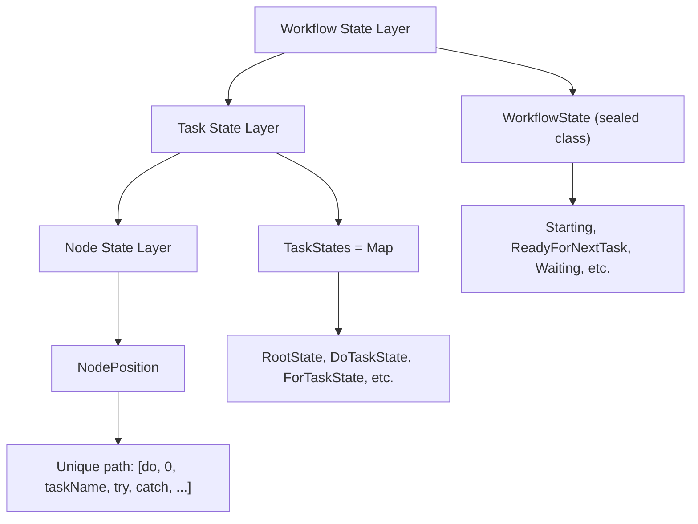
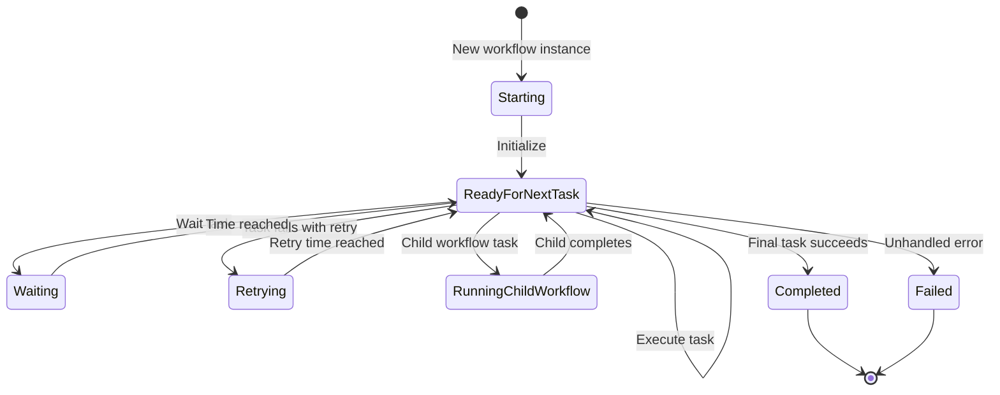

## Overview

Lemline implements a sophisticated state management system that balances performance, reliability, and horizontal scalability. The core principle is **state externalization** - workflow state is carried in messages rather than stored in memory.

<Info>
This approach follows the Serverless Workflow specification's stateless execution model, enabling any worker to resume any workflow.
</Info>

## State Architecture

Lemline separates state management into three layers:



### Layer 1: WorkflowState

The top-level state representing the workflow's execution phase.

<Tabs>
  <Tab title="Active States">
    <AccordionGroup>
      <Accordion title="Starting">
        Workflow just started with initial input.
        
        ```kotlin
        data class Starting(
            val startedAt: Instant,
            val input: JsonElement
        ) : WorkflowState()
        ```
        
        **Transition**: Immediately moves to `ReadyForNextTask` or executes first task.
      </Accordion>
      
      <Accordion title="ReadyForNextTask">
        Intermediate state after completing a task, ready for next execution.
        
        ```kotlin
        data class ReadyForNextTask(
            val taskStates: TaskStates,
            val nodePosition: NodePosition,
            val rawInput: JsonElement
        ) : WorkflowState()
        ```
        
        **Transition**: Continues to next task or enters pause state.
      </Accordion>
    </AccordionGroup>
  </Tab>
  
  <Tab title="Pause States">
    <AccordionGroup>
      <Accordion title="Waiting">
        Paused for time delay (wait task).
        
        ```kotlin
        data class Waiting(
            val waitUntil: Instant,
            val taskStates: TaskStates,
            val nodePosition: NodePosition
        ) : WorkflowState()
        ```
        
        **Storage**: Persisted to `lemline_waits` table
        
        **Resumption**: Outbox poller emits to `commands-in` when `waitUntil` reached
      </Accordion>
      
      <Accordion title="Retrying">
        Scheduled for retry after task failure.
        
        ```kotlin
        data class Retrying(
            val retryAt: Instant,
            val attemptIndex: Int,
            val taskStates: TaskStates,
            val nodePosition: NodePosition
        ) : WorkflowState()
        ```
        
        **Storage**: Persisted to `lemline_retries` table
        
        **Resumption**: Outbox poller emits to `commands-in` when `retryAt` reached
      </Accordion>
      
      <Accordion title="RunningChildWorkflow">
        Parent workflow paused while child workflow executes.
        
        ```kotlin
        data class RunningChildWorkflow(
            val childConfig: Config,
            val taskStates: TaskStates,
            val nodePosition: NodePosition
        ) : WorkflowState()
        ```
        
        **Storage**: Persisted to `lemline_parents` table
        
        **Resumption**: Child sends `CompletedMessage` to `events-in` which updates parent
      </Accordion>
    </AccordionGroup>
  </Tab>
  
  <Tab title="Terminal States">
    <AccordionGroup>
      <Accordion title="Completed">
        Workflow completed successfully.
        
        ```kotlin
        data class Completed(
            val output: JsonElement,
            val completedAt: Instant
        ) : WorkflowState()
        ```
        
        **Storage**: If parent exists or scheduled: sends `CompletedMessage` to `events-in`
        
        **No further transitions**
      </Accordion>
      
      <Accordion title="Failed">
        Workflow failed with unhandled error.
        
        ```kotlin
        data class Failed(
            val error: Error,
            val failedAt: Instant
        ) : WorkflowState()
        ```
        
        **Storage**: Persisted to `lemline_failures` table
        
        **No further transitions**
      </Accordion>
    </AccordionGroup>
  </Tab>
</Tabs>

### Layer 2: TaskStates

A map of node positions to task-specific runtime state.

```kotlin
typealias TaskStates = Map<NodePosition, TaskState>
```

<Info>
Stored as a map for O(1) state lookup by position. Any worker can find state for any node instantly.
</Info>

#### TaskState Hierarchy

<Tabs>
  <Tab title="Workflow-Level State">
    ```kotlin
    data class RootState(
        val id: IDV7,
        val rawInput: JsonElement,
        val context: JsonObject,  // Merged exports
        val exports: List<Export> // Export configurations
    ) : TaskState()
    ```
    
    **Purpose**: Maintains workflow-level context available to all tasks via `$context`.
  </Tab>
  
  <Tab title="Flow Task States">
    <AccordionGroup>
      <Accordion title="DoTaskState">
        Tracks current child in sequential execution.
        
        ```kotlin
        data class DoTaskState(
            val index: Int  // Current child index
        ) : TaskState()
        ```
      </Accordion>
      
      <Accordion title="ForTaskState">
        Tracks iteration state over collection.
        
        ```kotlin
        data class ForTaskState(
            val collection: List<JsonElement>,  // Remaining items
            val index: Int                       // Current iteration
        ) : TaskState()
        ```
        
        Provides scope variables: `$item` and `$index`
      </Accordion>
      
      <Accordion title="TryTaskState">
        Tracks retry attempts and error state.
        
        ```kotlin
        data class TryTaskState(
            val transformedInput: JsonElement,  // Saved for retries
            val attemptIndex: Int,              // 0-based attempt count
            val error: Error?                   // Last error if any
        ) : TaskState()
        ```
      </Accordion>
    </AccordionGroup>
  </Tab>
  
  <Tab title="Leaf Task State">
    ```kotlin
    data object SimpleTaskState : TaskState()
    ```
    
    **Purpose**: Empty marker for tasks that don't need runtime state (SET, EMIT, RAISE, etc.).
  </Tab>
</Tabs>

### Layer 3: NodePosition

Unique path-based identifier for nodes in the workflow tree.

```kotlin
typealias NodePosition = List<Any>  // Mix of tokens, indices, names
```

#### Position Components

<Steps>
  <Step title="Tokens">
    Structural markers identifying task types and nesting.
    
    Examples: `DO`, `TRY`, `CATCH`, `FORK`, `BRANCHES`
  </Step>
  
  <Step title="Indices">
    Integer child position (0-based).
    
    Example: `0`, `1`, `2` for first, second, third child
  </Step>
  
  <Step title="Names">
    Actual task name from DSL.
    
    Example: `"validateInput"`, `"httpCall"`
  </Step>
</Steps>

#### Position Examples

<CodeGroup>

```kotlin Root DO
[do]
// The root sequential task container
```

```kotlin First Child Task
[do, 0, "validateInput"]
// Token: do
// Index: 0 (first child)
// Name: "validateInput"
```

```kotlin Nested TRY Block
[do, 1, "callAPI", try, do, 0, "httpCall"]
// Parent: [do, 1, "callAPI"]
// Nested in TRY
// Child of inner DO at index 0
// Task name: "httpCall"
```

```kotlin Parallel Branch
[do, 2, "parallel", fork, branches, 0, "branch1"]
// Parent: [do, 2, "parallel"]
// FORK container
// BRANCHES collection
// First branch (index 0)
// Branch name: "branch1"
```

```kotlin CATCH Block
[do, 1, "callAPI", try, catch, do, 0, "handleError"]
// Same TRY parent
// CATCH instead of try DO
// First task in catch block
// Task name: "handleError"
```

</CodeGroup>

<Check>
**Benefits of Position-Based Addressing**:

- O(1) state lookup via `TaskStates` map
- Any worker can resume from any position
- Deterministic across workflow executions
- Supports navigation (parent, children, siblings)
- Enables precise error location reporting
</Check>

## State Delta Pattern

Lemline uses a delta-based approach for state updates to minimize data transfer.

### StepResult Structure

```kotlin
data class StepResult(
    val nextNode: Node<*>?,                      // Next node to execute
    val rawInput: JsonElement?,                  // Input for next node
    val stateUpdates: Map<NodePosition, TaskState?>,  // Delta updates
    val flowDirective: FlowDirective?,           // Branch redirect
    val retryAt: Instant?                        // Retry scheduling
)
```

### Delta Application

```kotlin
// Apply state delta atomically
fun applyDelta(
    current: TaskStates,
    delta: Map<NodePosition, TaskState?>
): TaskStates {
    val updated = current.toMutableMap()
    delta.forEach { (position, state) ->
        if (state == null) {
            updated.remove(position)  // null = remove from map
        } else {
            updated[position] = state  // Update or insert
        }
    }
    return updated.toMap()
}
```

<Info>
**Why Delta Pattern?**

- Only changed state sent in messages
- Reduces message size (important for high-throughput)
- Failed steps leave original state untouched
- Atomic updates prevent partial state corruption
</Info>

## State Persistence Strategy

Lemline uses a selective persistence strategy: **only persist when necessary**.

### Hot Path: No Persistence

Active workflows executing in the workflow channel:

```
commands-in → Handler → Orchestrator → Handler → commands-out
```

<Check>
**No database writes**:
- State carried entirely in messages
- High throughput (10,000+ msg/s)
- Low latency (~milliseconds)
- Horizontal scaling without database bottleneck
</Check>

### Cold Path: Selective Persistence

Only persist when workflow must pause:

<Tabs>
  <Tab title="Wait Tasks">
    **Trigger**: `WorkflowState.Waiting`
    
    **Storage**: `lemline_waits` table
    
    **Data**:
    ```sql
    INSERT INTO lemline_waits (
      id,
      workflow_id,
      instance_message,  -- Serialized InstanceMessage
      outbox_scheduled_for,
      outbox_status
    ) VALUES (?, ?, ?, ?, 'PENDING')
    ```
    
    **Resumption**: Outbox poller queries `WHERE outbox_scheduled_for <= NOW()`
  </Tab>
  
  <Tab title="Retry Tasks">
    **Trigger**: `WorkflowState.Retrying`
    
    **Storage**: `lemline_retries` table
    
    **Data**:
    ```sql
    INSERT INTO lemline_retries (
      id,
      workflow_id,
      instance_message,
      outbox_scheduled_for,  -- Calculated from backoff
      outbox_attempt_count,
      outbox_status
    ) VALUES (?, ?, ?, ?, ?, 'PENDING')
    ```
    
    **Resumption**: Outbox poller with backoff calculation
  </Tab>
  
  <Tab title="Child Workflows">
    **Trigger**: `WorkflowState.RunningChildWorkflow`
    
    **Storage**: `lemline_parents` table
    
    **Data**:
    ```sql
    INSERT INTO lemline_parents (
      id,
      workflow_id,
      child_id,
      instance_message,
      outbox_status
    ) VALUES (?, ?, ?, ?, 'PENDING')
    ```
    
    **Resumption**: Child sends `CompletedMessage` which triggers parent update
  </Tab>
  
  <Tab title="Failures">
    **Trigger**: `WorkflowState.Failed`
    
    **Storage**: `lemline_failures` table
    
    **Data**:
    ```sql
    INSERT INTO lemline_failures (
      id,
      workflow_id,
      workflow_namespace,
      workflow_name,
      workflow_version,
      error_type,
      error_status,
      error_title,
      error_details,
      failed_at
    ) VALUES (?, ?, ?, ?, ?, ?, ?, ?, ?, ?)
    ```
    
    **No resumption**: Terminal state
  </Tab>
</Tabs>

## State Serialization

Workflow state is serialized for message transport and database storage.

### Message Transport: Binary Protobuf

```kotlin
// Serialize InstanceMessage to binary protobuf
val bytes = InstanceMessage.encode(instanceMessage)

// Send via message broker
emitter.send(Message.of(bytes))
```

<Info>
**Why Protobuf for Transport?**

- Compact binary format (smaller message size)
- Fast serialization/deserialization
- Schema evolution support
- Cross-language compatibility
</Info>

### Database Storage: ProtoJSON

```kotlin
// Serialize InstanceMessage to JSON for database
val json = InstanceMessage.encodeToJson(instanceMessage)

// Store in JSONB column
val sql = """INSERT INTO lemline_waits 
             (id, instance_message) VALUES (?, ?::jsonb)"""
```

<Info>
**Why JSON for Database?**

- Human-readable for debugging
- Queryable with PostgreSQL JSONB operators
- Schema flexibility
- Compatible with MySQL and H2
</Info>

## State Lifecycle

Complete workflow state lifecycle from start to completion:



### State Transitions

<Steps>
  <Step title="Workflow Start">
    `Starting` → `ReadyForNextTask`
    
    Initial input processed, first task identified
  </Step>
  
  <Step title="Task Execution">
    `ReadyForNextTask` → `ReadyForNextTask`
    
    Task completes, next task begins (hot path)
  </Step>
  
  <Step title="Pause Point">
    `ReadyForNextTask` → `Waiting` | `Retrying` | `RunningChildWorkflow`
    
    Workflow paused, state persisted to database
  </Step>
  
  <Step title="Resumption">
    `Waiting` | `Retrying` | `RunningChildWorkflow` → `ReadyForNextTask`
    
    Condition met, workflow resumes execution
  </Step>
  
  <Step title="Completion">
    `ReadyForNextTask` → `Completed` | `Failed`
    
    Terminal state reached, workflow ends
  </Step>
</Steps>

## Context Management

Lemline maintains workflow-level context via `RootState`.

### Context Structure

```kotlin
data class RootState(
    val context: JsonObject,  // Merged exports from all tasks
    val exports: List<Export> // Export configurations
) : TaskState()
```

### Export Merging

```yaml
do:
  - fetchUser:
      call: http
      with:
        uri: https://api.example.com/users/123
      export:
        as:
          currentUser: .
          userId: .id
  
  - fetchOrders:
      call: http
      with:
        uri: https://api.example.com/users/${ $context.userId }/orders
      export:
        as:
          orders: .
```

**Context after fetchUser**:
```json
{
  "currentUser": { "id": 123, "name": "Alice" },
  "userId": 123
}
```

**Context after fetchOrders**:
```json
{
  "currentUser": { "id": 123, "name": "Alice" },
  "userId": 123,
  "orders": [ { "id": 1, "total": 99.99 } ]
}
```

<Check>
**Context Benefits**:

- Cross-task data sharing without passing through input/output
- Hierarchical scope merging (child tasks inherit parent context)
- Available via `$context` in all expressions
- Persisted as part of `RootState` in `TaskStates` map
</Check>

## Best Practices

<CardGroup cols={2}>
  <Card title="Minimize State Size" icon="compress">
    Keep task state minimal. Don't store large payloads in state.
    
    Use context exports sparingly - only export what's needed.
  </Card>
  
  <Card title="Design for Resumption" icon="play">
    Assume workflows can pause and resume at any time.
    
    Don't rely on in-memory caches or local state.
  </Card>
  
  <Card title="Use Correlation" icon="link">
    When waiting for events, use correlation keys to ensure correct delivery.
    
    Prevents cross-instance event pollution.
  </Card>
  
  <Card title="Handle State Corruption" icon="shield">
    Implement validation and error handling for state deserialization.
    
    Workflow definitions can change between pause and resumption.
  </Card>
</CardGroup>

## Next Steps

<CardGroup cols={2}>
  <Card title="Architecture" icon="sitemap" href="/concepts/architecture">
    Understand the overall system architecture
  </Card>
  <Card title="Workflow DSL" icon="file-code" href="/concepts/workflow-dsl">
    Learn about the Serverless Workflow DSL
  </Card>
  <Card title="Event-Driven Orchestration" icon="bolt" href="/concepts/event-driven-orchestration">
    Explore event-driven patterns
  </Card>
  <Card title="Error Handling" icon="triangle-exclamation" href="/concepts/error-handling">
    Discover error handling mechanisms
  </Card>
</CardGroup>
