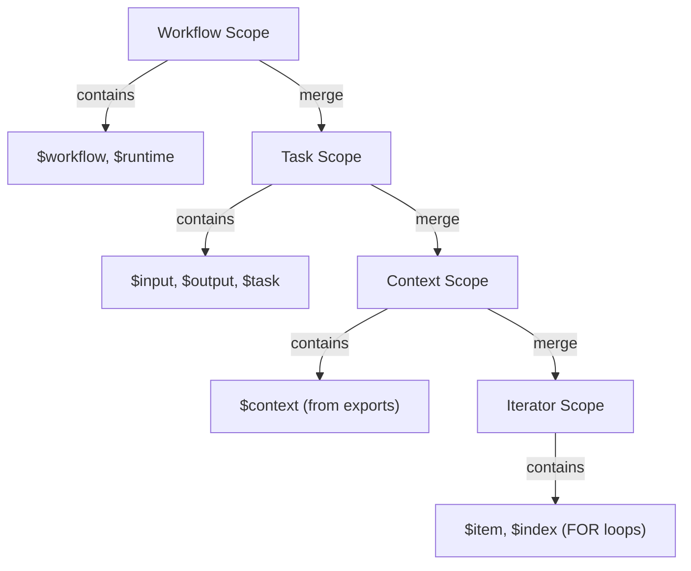

## Overview

Lemline implements the [Serverless Workflow DSL v1.0](https://github.com/serverlessworkflow/specification) specification, providing a standardized way to define event-driven, stateful workflows.

<Info>
The Serverless Workflow DSL is a vendor-neutral, open-source specification for defining workflows that can run across different platforms and cloud providers.
</Info>

## Core Principles

Lemline's orchestrator follows these key design principles:

### 1. Pure Functional Model

Workflow execution is modeled as pure functions with external state.

<CardGroup cols={2}>
  <Card title="External State" icon="box">
    State stored in `TaskStates = Map<NodePosition, TaskState>`
    
    Orchestrator is stateless - any worker can resume from any position
  </Card>
  <Card title="Immutability" icon="lock">
    Node tree is immutable - shared across all workflow executions
    
    No node cloning or mutation during execution
  </Card>
</CardGroup>

**Atomic Updates**:
```kotlin
// Apply state delta atomically
states = applyDelta(states, stepResult.stateUpdates)
// null value = remove from map
```

### 2. Dataset Flow

Aligned with the specification's [data flow model](https://github.com/serverlessworkflow/specification/blob/main/dsl.md#data-flow):

- Dataset flows as a parameter through the execution chain
- Not stored in state - passed between tasks functionally
- Transformed at task boundaries via `input.from` and `output.as` expressions
- In sequential tasks (DO), previous output becomes next input

### 3. Exception-Driven Control Flow

Lemline uses exceptions to signal workflow pause points:

<Tabs>
  <Tab title="WaitWorkflowException">
    Thrown when a wait task needs a time delay.
    
    The runner handles this by creating a wait outbox entry.
  </Tab>
  <Tab title="ChildWorkflowException">
    Thrown when a child workflow must be spawned.
    
    The runner handles this by creating a parent outbox entry and starting the child.
  </Tab>
  <Tab title="InternalWorkflowException">
    Thrown on task execution error.
    
    Can be caught by TRY blocks with retry logic.
  </Tab>
</Tabs>

<Note>
This pattern separates workflow logic (orchestrator) from infrastructure concerns (runner).
</Note>

## Task Flow Model

Per the [specification's task flow model](https://github.com/serverlessworkflow/specification/blob/main/dsl.md#task-flow), each task completes with one of three outcomes:

### Task Execution Outcomes

<AccordionGroup>
  <Accordion title="1. Continue" icon="arrow-right">
    Proceed to next task.
    
    ```kotlin
    // Implicit: next task in DO sequence
    StepResult(nextNode = doState.nextChild(), ...)
    
    // Explicit: SWITCH redirects via FlowDirective
    StepResult(flowDirective = FlowDirective(targetPosition, targetName), ...)
    ```
  </Accordion>
  
  <Accordion title="2. Fault" icon="triangle-exclamation">
    Uncaught error halts execution.
    
    ```kotlin
    throw InternalWorkflowException(error)
    // If no TRY catches error → WorkflowState.Failed
    ```
  </Accordion>
  
  <Accordion title="3. End" icon="flag-checkered">
    Graceful termination.
    
    ```kotlin
    // Root task returns null for nextNode
    StepResult(nextNode = null, ...) → WorkflowState.Completed
    ```
  </Accordion>
</AccordionGroup>

### Flow Directives

Aligned with spec: "Flow directives can only redirect to tasks declared within their own scope."

<CardGroup cols={2}>
  <Card title="DO" icon="list">
    Sequential execution with implicit ordering
  </Card>
  <Card title="SWITCH" icon="code-branch">
    Conditional branching to named sibling via `FlowDirective`
  </Card>
  <Card title="FOR" icon="rotate">
    Iterative execution over collection
  </Card>
  <Card title="FORK" icon="code-fork">
    Concurrent execution of branches
  </Card>
</CardGroup>

## Data Flow Pipeline

Lemline implements the specification's [data transformation pipeline](https://github.com/serverlessworkflow/specification/blob/main/dsl.md#data-flow).

```mermaid
graph LR
    A[Workflow Input] --> B[Validate workflow input schema]
    B --> C[input.from transformation]
    C --> D[Task Input]
    D --> E[Validate task input schema]
    E --> F[Task input.from transformation]
    F --> G[Execute Task]
    G --> H[Task output.as transformation]
    H --> I[Validate task output schema]
    I --> J[export.as to context]
    J --> K[Next Task Input]
```



### Input Transformation

**Pipeline**:
1. **Conditional Execution**: Evaluate `if` expression - skip if false
2. **Input Validation**: Validate against `input.schema` if defined
3. **Input Transformation**: Apply `input.from` expression
4. **State Creation**: Create processor-specific state with transformed input

**Example**:
```yaml
validateOrder:
  input:
    schema:
      type: object
      required: [orderId, customerId]
    from: .request.body  # Extract from nested property
  call: http
  with:
    uri: https://api.example.com/validate
```

### Output Transformation

**Pipeline**:
1. **Output Transformation**: Apply `output.as` expression
2. **Output Validation**: Validate against `output.schema` if defined
3. **Context Export**: Apply `export.as` expressions, merge into workflow context
4. **Flow to Next**: Transformed output becomes next task's input

**Example**:
```yaml
fetchUser:
  call: http
  with:
    uri: https://api.example.com/users/123
  output:
    as: .body  # Extract body from response
  export:
    as:
      currentUser: .
      userId: .id
```

### Sequential Data Flow (DO)

In DO tasks, output chains through children:

```
Task1 input: {}
Task1 output: {x: 1}

Task2 input: {x: 1}         ← Previous output
Task2 output: {x: 1, y: 2}

Task3 input: {x: 1, y: 2}   ← Previous output
Task3 output: {sum: 3}
```

**Implementation**:
```kotlin
// DoProcessor.enterFromChild()
val nextChild = children[state.index + 1]
StepResult(
    nextNode = nextChild,
    rawInput = datasetFromChild  // Previous output
)
```

## Runtime Expressions

Lemline implements the specification's [runtime expression model](https://github.com/serverlessworkflow/specification/blob/main/dsl.md#runtime-expressions) using JQ as the expression language.

### Expression Language

**Default**: JQ (JSONPath Query)
**Evaluator**: `ExpressionEvaluator.kt` wraps JQ engine

**Expression Syntax**:
```yaml
# Simple path
value: .input.userId

# Runtime expression (must be wrapped in ${})
value: ${ .context.currentUser.name }

# Complex transformation
value: ${ .items | map(.price) | add }
```

### Standard Arguments

Per the [specification's runtime expression arguments](https://github.com/serverlessworkflow/specification/blob/main/dsl.md#runtime-expressions):

| Variable | Description | Type | Availability |
|----------|-------------|------|-------------|
| `$input` | Current task's input data | JsonElement | Task expressions |
| `$output` | Current task's output data | JsonElement | `output.as`, `export.as` |
| `$task` | Task metadata (name, startedAt, etc.) | TaskDescriptor | Task expressions |
| `$context` | Workflow context from exports | JsonObject | All task expressions |
| `$workflow` | Workflow metadata (namespace, name, version) | WorkflowDescriptor | All expressions |
| `$runtime` | Runtime information | JsonObject | All expressions |

**Task-Specific Variables**:
- `$item` - Current item in FOR loop (name configured via `each`)
- `$index` - Current index in FOR loop (name configured via `at`)
- `$error` - Error details in CATCH blocks

### Scope Hierarchy

Scopes are hierarchical - child scopes merge with parent scopes:



**Implementation**:
```kotlin
// Scope = JsonObject (type alias)
val scope = parentScope.deepMerge(taskContext.toScope(node))
```

## Supported Task Types

Lemline implements all 12 official task types from the specification:

<Tabs>
  <Tab title="Flow Tasks">
    <AccordionGroup>
      <Accordion title="DO - Sequential Execution">
        Execute tasks in sequence, where each task's output becomes the next task's input.
        
        ```yaml
        do:
          - task1: ...
          - task2: ...
          - task3: ...
        ```
      </Accordion>
      
      <Accordion title="FOR - Iteration">
        Execute tasks for each item in a collection.
        
        ```yaml
        for:
          each: item
          in: .items
          at: index
        do:
          - processItem: ...
        ```
      </Accordion>
      
      <Accordion title="SWITCH - Conditional Branching">
        Route execution based on conditions.
        
        ```yaml
        switch:
          - when: .status == "approved"
            then: approvalPath
          - when: .status == "rejected"
            then: rejectionPath
        ```
      </Accordion>
      
      <Accordion title="TRY - Error Handling">
        Execute tasks with error handling and retry logic.
        
        ```yaml
        try:
          do:
            - riskyTask: ...
        errors:
          retry:
            strategy: exponential
            limit:
              attempt:
                count: 3
        ```
      </Accordion>
    </AccordionGroup>
  </Tab>
  
  <Tab title="Activity Tasks">
    <AccordionGroup>
      <Accordion title="CALL HTTP - HTTP Requests">
        Make HTTP/REST API calls.
        
        ```yaml
        call: http
        with:
          method: POST
          uri: https://api.example.com/users
          headers:
            Content-Type: application/json
          body:
            name: ${ .userName }
        ```
      </Accordion>
      
      <Accordion title="RUN SHELL - Shell Commands">
        Execute shell commands.
        
        ```yaml
        run:
          shell:
            command: echo
            arguments:
              message: ${ .greeting }
        ```
      </Accordion>
      
      <Accordion title="RUN WORKFLOW - Child Workflows">
        Spawn and wait for child workflows.
        
        ```yaml
        run:
          workflow:
            namespace: ecommerce
            name: payment-processor
            version: 1.0.0
        with:
          orderId: ${ .orderId }
        ```
      </Accordion>
      
      <Accordion title="RUN SCRIPT - Script Execution">
        Execute inline scripts.
        
        ```yaml
        run:
          script:
            language: javascript
            code: |
              return { result: input.x + input.y };
        ```
      </Accordion>
      
      <Accordion title="WAIT - Time Delays">
        Pause workflow execution.
        
        ```yaml
        wait: PT5M  # Wait 5 minutes
        ```
      </Accordion>
      
      <Accordion title="LISTEN - Event Consumption">
        Wait for and react to external events.
        
        ```yaml
        listen:
          to:
            one:
              with:
                type: com.example.order.created
        ```
        
        <Info>See [Event-Driven Orchestration](/concepts/event-driven-orchestration) for details.</Info>
      </Accordion>
    </AccordionGroup>
  </Tab>
  
  <Tab title="Data Tasks">
    <AccordionGroup>
      <Accordion title="SET - Variable Assignment">
        Set variables in the workflow context.
        
        ```yaml
        set:
          orderStatus: approved
          approvedAt: ${ now }
        ```
      </Accordion>
      
      <Accordion title="EMIT - Event Publishing">
        Publish CloudEvents to external systems.
        
        ```yaml
        emit:
          event:
            with:
              source: https://petstore.com
              type: com.petstore.order.placed.v1
              data:
                orderId: ${ .orderId }
        ```
      </Accordion>
      
      <Accordion title="RAISE - Error Generation">
        Explicitly raise errors.
        
        ```yaml
        raise:
          error:
            type: https://example.com/errors/validation
            status: 400
            title: Invalid Order
        ```
      </Accordion>
    </AccordionGroup>
  </Tab>
</Tabs>

## Execution Modes

The orchestrator supports different execution modes:

<Tabs>
  <Tab title="CONTINUOUS">
    Run to completion without pausing.
    
    **Use case**: Testing, single-node execution
  </Tab>
  <Tab title="TASK_BY_TASK">
    Pause after each task.
    
    **Use case**: Distributed execution, step debugging
  </Tab>
  <Tab title="ACTIVITY_BY_ACTIVITY">
    Pause only after activities (HTTP, shell, etc.).
    
    **Use case**: Production distributed execution (default)
  </Tab>
</Tabs>

## Processor Pattern

Each task type has a `NodeProcessor<T, S>` implementing a template method pattern.

### Entry Points

<Steps>
  <Step title="enterFromParent">
    First entry from parent task with raw input and scope.
  </Step>
  <Step title="enterFromChild">
    Re-entry after child completes (for flow tasks).
  </Step>
  <Step title="continueTo">
    Resume after pause (wait, retry).
  </Step>
</Steps>

### Standard Pipeline

```
Input → If Check → Validate → Transform → Execute → Complete → Output
```

## Next Steps

<CardGroup cols={2}>
  <Card title="Architecture Overview" icon="sitemap" href="/concepts/architecture">
    Understand the overall system architecture
  </Card>
  <Card title="Event-Driven Orchestration" icon="bolt" href="/concepts/event-driven-orchestration">
    Learn about event-driven workflow patterns
  </Card>
  <Card title="State Management" icon="database" href="/concepts/state-management">
    Explore state management strategies
  </Card>
  <Card title="Quickstart" icon="rocket" href="/quickstart">
    Get started with Lemline
  </Card>
</CardGroup>
