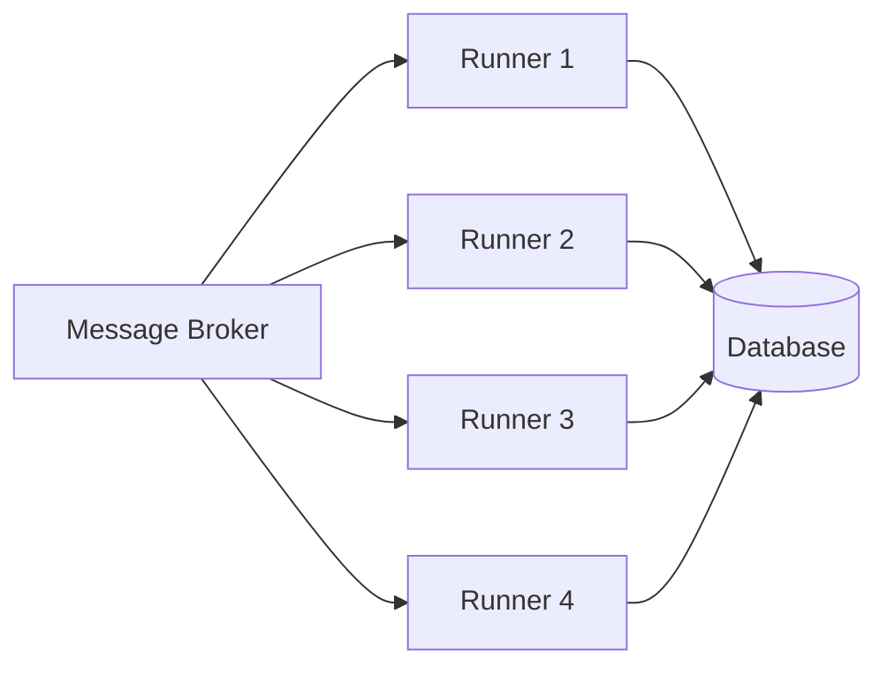

Lemline runners are designed for horizontal scalability. Add more runners to increase throughput without coordination overhead or configuration changes.

## Stateless Architecture

Lemline's stateless design enables seamless horizontal scaling:

- **No Sticky Sessions**: Any runner can process any workflow message
- **No Shared State**: Workflow state is carried in messages, not in memory
- **No Coordination**: Runners operate independently without leader election
- **Database-Backed Durability**: Only durable operations touch the database

## How It Works

### Message-Driven Load Distribution

Load distribution happens naturally through your message broker:



1. Workflow messages arrive in broker topics/queues
2. Broker distributes messages across consumer group members
3. Each runner processes messages independently
4. Runners write to shared database only when needed (waits, retries, checkpoints)

### Dual-Channel Processing

Lemline uses two channels for optimal performance:

- **Commands Channel** (`commands-in/out`): High-throughput stateless execution
- **Events Channel** (`events-out`): Durable workflow operations requiring DB guarantees

Both channels support horizontal scaling with consumer groups.

## Scaling Strategies

### Manual Scaling

Add more runners by starting additional instances with identical configuration:

**Docker:**
```bash
# Start first runner
docker run -d --name lemline-runner-1 \
  -e LEMLINE_DATABASE_POSTGRESQL_HOST=postgres \
  -e LEMLINE_MESSAGING_KAFKA_BROKERS=kafka:9092 \
  lemline-runner:latest listen

# Start second runner
docker run -d --name lemline-runner-2 \
  -e LEMLINE_DATABASE_POSTGRESQL_HOST=postgres \
  -e LEMLINE_MESSAGING_KAFKA_BROKERS=kafka:9092 \
  lemline-runner:latest listen

# Start third runner
docker run -d --name lemline-runner-3 \
  -e LEMLINE_DATABASE_POSTGRESQL_HOST=postgres \
  -e LEMLINE_MESSAGING_KAFKA_BROKERS=kafka:9092 \
  lemline-runner:latest listen
```

**Kubernetes:**
```bash
# Scale to 10 replicas
kubectl scale deployment lemline-runner --replicas=10 -n lemline

# Verify scaling
kubectl get pods -n lemline -l app=lemline-runner
```

**Native Binary:**
```bash
# Terminal 1
LEMLINE_CONFIG=./lemline.yaml ./lemline-runner listen

# Terminal 2
LEMLINE_CONFIG=./lemline.yaml ./lemline-runner listen

# Terminal 3
LEMLINE_CONFIG=./lemline.yaml ./lemline-runner listen
```

### Kubernetes Horizontal Pod Autoscaler

Automatically scale based on metrics:

```yaml
apiVersion: autoscaling/v2
kind: HorizontalPodAutoscaler
metadata:
  name: lemline-runner-hpa
  namespace: lemline
spec:
  scaleTargetRef:
    apiVersion: apps/v1
    kind: Deployment
    name: lemline-runner
  minReplicas: 3
  maxReplicas: 50
  metrics:
  - type: Resource
    resource:
      name: cpu
      target:
        type: Utilization
        averageUtilization: 70
  - type: Resource
    resource:
      name: memory
      target:
        type: Utilization
        averageUtilization: 80
```

### Custom Metrics Autoscaling

Scale based on Kafka consumer lag or queue depth:

```yaml
metrics:
- type: External
  external:
    metric:
      name: kafka_consumergroup_lag
      selector:
        matchLabels:
          consumergroup: lemline-worker-group
    target:
      type: AverageValue
      averageValue: "1000"
```

<Note>
Requires metrics adapter like Prometheus Adapter or Keda.
</Note>

## Kafka-Specific Scaling

### Consumer Group Balancing

Kafka distributes partitions across consumers in a group:

- **Partitions**: Number of topic partitions determines max parallelism
- **Consumers**: More consumers than partitions results in idle consumers
- **Rebalancing**: Adding/removing consumers triggers partition rebalancing

**Recommendation:**
```yaml
lemline:
  messaging:
    kafka:
      commands:
        topic: lemline-commands
        partitions: 24  # Support up to 24 concurrent consumers
      events:
        topic: lemline-events
        partitions: 12
```

### Consumer Lag Monitoring

Monitor consumer lag to determine when to scale:

```bash
# Check consumer lag
kafka-consumer-groups.sh \
  --bootstrap-server kafka:9092 \
  --describe \
  --group lemline-worker-group

# Output:
GROUP               TOPIC             PARTITION  LAG
lemline-worker-group lemline-commands  0         1234
lemline-worker-group lemline-commands  1         856
```

**Scaling rules:**
- Lag < 100: Optimal (current capacity sufficient)
- Lag 100-1000: Consider scaling up
- Lag > 1000: Scale up immediately
- Lag = 0: Consider scaling down

## RabbitMQ-Specific Scaling

### Queue Prefetch Configuration

Control how many messages each runner prefetches:

```yaml
lemline:
  messaging:
    rabbitmq:
      prefetch-count: 10  # Messages per runner
```

**Guidelines:**
- Lower prefetch (1-5): Better load distribution, more overhead
- Higher prefetch (10-50): Better throughput, less even distribution
- Start with 10 and adjust based on message processing time

### Queue Depth Monitoring

Monitor queue depth to trigger scaling:

```bash
# Check queue depth
rabbitmqctl list_queues name messages consumers

# Output:
Queue              Messages  Consumers
lemline-commands   523       3
lemline-events     12        3
```

**Scaling rules:**
- Messages/Consumer < 10: Optimal
- Messages/Consumer 10-100: Consider scaling up
- Messages/Consumer > 100: Scale up immediately

## PGMQ-Specific Scaling

### Polling Configuration

PGMQ uses PostgreSQL for messaging with polling-based consumption:

```yaml
lemline:
  messaging:
    pgmq:
      poll-interval: 100ms
      batch-size: 10
      visibility-timeout: 30s
```

**Scaling considerations:**
- More runners increase database load (polling queries)
- Use connection pooling to manage database connections
- Monitor PostgreSQL CPU and connection count

### Database Connection Pooling

```yaml
lemline:
  database:
    postgresql:
      max-pool-size: 20  # Per runner
      min-pool-size: 5
```

**Formula:** Total connections = (runners × max-pool-size) + buffer

Example: 10 runners × 20 connections = 200 connections + 20 buffer = 220

Ensure PostgreSQL `max_connections` setting accommodates total connections.

## Scaling Limits

### Message Broker Limits

| Broker | Scaling Factor | Notes |
|--------|----------------|-------|
| Kafka | Up to partitions | Max runners = topic partitions |
| RabbitMQ | Unlimited | Limited by queue throughput |
| PGMQ | Database-limited | Limited by PostgreSQL connections and CPU |

### Database Limits

- **Connection Pool Exhaustion**: Monitor active connections
- **Lock Contention**: Outbox queries use `FOR UPDATE SKIP LOCKED`
- **I/O Throughput**: High workflow count may saturate database I/O

### Practical Limits

**Small-to-medium workflows:**
- 10-50 runners: Typical for most deployments
- 50-100 runners: High-throughput production systems
- 100+ runners: Enterprise-scale deployments

**Large workflows (complex state):**
- Serialization/deserialization overhead increases with workflow size
- Consider breaking large workflows into smaller sub-workflows

## Performance Tuning

### JVM Tuning

Optimize JVM settings for scaled deployments:

```bash
JAVA_OPTS="-Xmx2g -Xms1g \
  -XX:+UseG1GC \
  -XX:MaxGCPauseMillis=200 \
  -XX:+ParallelRefProcEnabled \
  -XX:+UseStringDeduplication"
```

### Native Image Tuning

Native images have lower memory overhead:

```bash
# Native image memory usage ~50% of JVM
# Can run 2x more native runners on same hardware
```

### Database Query Optimization

**Outbox Queries (FOR UPDATE SKIP LOCKED):**
```sql
SELECT * FROM waits 
WHERE execute_at <= NOW() 
ORDER BY execute_at 
LIMIT 1000 
FOR UPDATE SKIP LOCKED;
```

This pattern prevents lock contention across multiple runners.

**Indexes:**
Ensure indexes exist on:
- `execute_at` (waits, retries)
- `workflow_instance_id` (all tables)
- `status` (where applicable)

Migrations include these indexes automatically.

## Monitoring and Metrics

### Key Metrics to Monitor

**Throughput:**
- Workflows started per second
- Tasks executed per second
- Messages processed per second

**Latency:**
- Workflow execution time (p50, p95, p99)
- Task execution time
- Database query latency

**Resource Usage:**
- CPU utilization per runner
- Memory usage per runner
- Database connections
- Message broker consumer lag

**Error Rates:**
- Failed workflows
- Retried tasks
- Infrastructure errors

### Prometheus Metrics

Lemline exposes Micrometer metrics compatible with Prometheus:

```yaml
# Scrape configuration
scrape_configs:
- job_name: 'lemline-runner'
  static_configs:
  - targets: ['runner-1:9445', 'runner-2:9445', 'runner-3:9445']
  metrics_path: '/q/metrics'
```

### Alerting Rules

```yaml
groups:
- name: lemline
  rules:
  - alert: HighConsumerLag
    expr: kafka_consumergroup_lag{group="lemline-worker-group"} > 5000
    for: 5m
    annotations:
      summary: "High consumer lag detected"
      description: "Consider scaling up runners"

  - alert: LowThroughput
    expr: rate(lemline_workflows_started_total[5m]) < 1
    for: 10m
    annotations:
      summary: "Low workflow throughput"

  - alert: HighErrorRate
    expr: rate(lemline_workflows_failed_total[5m]) > 10
    for: 5m
    annotations:
      summary: "High workflow failure rate"
```

## Testing Scalability

### Load Testing

<Steps>
  <Step title="Deploy baseline runners">
    Start with 3 runners to establish baseline performance.
  </Step>

  <Step title="Generate load">
    Use workflow submission tools or scripts to generate realistic load.
  </Step>

  <Step title="Monitor metrics">
    Track throughput, latency, consumer lag, and resource usage.
  </Step>

  <Step title="Scale incrementally">
    Add runners in increments (e.g., 3 → 6 → 12 → 24).
  </Step>

  <Step title="Identify bottlenecks">
    Watch for:
    - Database connection exhaustion
    - Message broker throughput limits
    - Network bandwidth saturation
  </Step>
</Steps>

### Stress Testing

Test beyond expected capacity:

1. **Burst traffic**: Sudden spike in workflow submissions
2. **Sustained load**: Continuous high throughput for hours
3. **Failure scenarios**: Kill runners mid-processing to verify resilience

## Best Practices

<AccordionGroup>
  <Accordion title="Start with 3+ runners">
    Always run at least 3 runners for high availability, even in development.
  </Accordion>

  <Accordion title="Monitor consumer lag">
    Consumer lag is the best indicator of when to scale. Set up alerts at lag > 1000.
  </Accordion>

  <Accordion title="Scale gradually">
    Double runners at a time (3 → 6 → 12) rather than large jumps. Monitor impact before further scaling.
  </Accordion>

  <Accordion title="Use autoscaling in production">
    Kubernetes HPA or cloud autoscaling groups handle traffic variations automatically.
  </Accordion>

  <Accordion title="Provision adequate database resources">
    As you scale runners, ensure database CPU, memory, and connections scale proportionally.
  </Accordion>

  <Accordion title="Partition Kafka topics appropriately">
    Create enough partitions to support your max expected runner count (e.g., 24-48 partitions).
  </Accordion>

  <Accordion title="Test failure scenarios">
    Regularly test runner failures during load to verify graceful degradation.
  </Accordion>
</AccordionGroup>

## Troubleshooting Scaling Issues

### Throughput not increasing with runners

**Possible causes:**
- Database bottleneck (CPU, I/O, connections)
- Message broker partition limit (Kafka)
- Network bandwidth saturation

**Solutions:**
- Scale database vertically or use read replicas
- Increase Kafka topic partitions
- Optimize workflow definitions (reduce state size)

### High CPU usage on runners

**Possible causes:**
- Complex workflows with large state serialization
- Inefficient task processors
- JVM garbage collection overhead

**Solutions:**
- Use native images for lower CPU overhead
- Profile with JVM profilers (JFR, async-profiler)
- Optimize workflow definitions

### Database connection exhaustion

**Symptoms:**
```
Connection pool exhausted
Could not acquire connection
```

**Solutions:**
```yaml
lemline:
  database:
    postgresql:
      max-pool-size: 15  # Reduce per-runner connections
```

Or increase PostgreSQL `max_connections`:
```sql
ALTER SYSTEM SET max_connections = 500;
SELECT pg_reload_conf();
```

## Next Steps

<CardGroup cols={2}>
  <Card title="Kubernetes Deployment" icon="dharmachakra" href="/deployment/kubernetes">
    Deploy with autoscaling on Kubernetes
  </Card>
  <Card title="Monitoring" icon="chart-line" href="/operations/monitoring">
    Set up monitoring and alerting
  </Card>
  <Card title="Configuration" icon="gear" href="/configuration/overview">
    Optimize configuration for scale
  </Card>
  <Card title="Performance Tuning" icon="gauge-high" href="/operations/performance">
    Advanced performance optimization
  </Card>
</CardGroup>