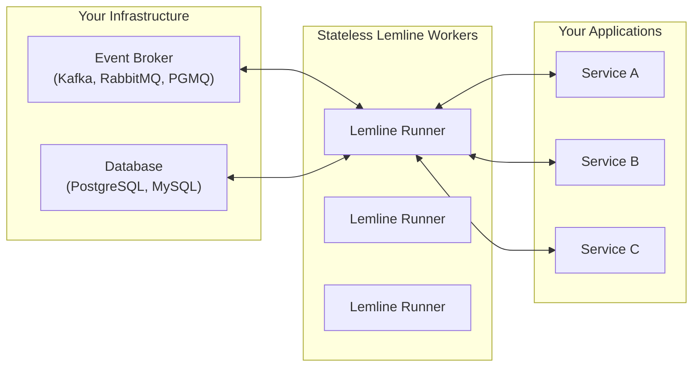

## What is Lemline?

Lemline is a modern runtime for the [Serverless Workflow DSL](https://github.com/serverlessworkflow/specification) version 1.0, enabling the execution of complex workflows defined in YAML or JSON **on top of your existing infrastructure**. It leverages modern best practices for performance, reliability, and extensibility.

<Note>
Lemline runs on top of your existing infrastructure. All you need to deploy are stateless Lemline Runners that connect to **your event broker** and **your database**.
</Note>

## Key Features

<CardGroup cols={2}>
  <Card title="Serverless Workflow DSL" icon="code">
    Faithfully implements the Serverless Workflow specification for defining and running workflows with YAML or JSON
  </Card>
  
  <Card title="Event-Driven Orchestration" icon="bolt">
    State transitions are carried within broker messages, minimizing database load and improving throughput
  </Card>
  
  <Card title="Stateless Workers" icon="layer-group">
    Horizontal scaling is as simple as starting more Lemline workers. No sticky sessions, no shared state
  </Card>
  
  <Card title="Native Binary Support" icon="microchip">
    Deploy as a lean, self-contained binary built with GraalVM/Mandrel. Startup in milliseconds with reduced memory footprint
  </Card>
  
  <Card title="Resilient Error Management" icon="shield-halved">
    Automatic retries, failure tracking, and clear separation between infrastructure and business logic errors
  </Card>
  
  <Card title="Built-in Observability" icon="chart-line">
    Micrometer integration with Prometheus-compatible metrics, health checks, and lifecycle events
  </Card>
</CardGroup>

## Why Lemline?

Lemline is designed to be an extremely fast and efficient workflow orchestrator. It uses an event-driven approach, primarily communicating via messages rather than constantly reading from and writing to a database.

This allows Lemline to orchestrate business processes that would typically be implemented through choreography (peer-to-peer communication between services) without needing a database for every interaction.

### Performance-First Design

<Steps>
  <Step title="Workflow state compressed in messages">
    The workflow's current state is compressed and included within event messages, eliminating constant database reads
  </Step>
  
  <Step title="Database used strategically">
    The database is only used when strictly necessary: time delays, retrying failed tasks, or waiting for parallel tasks to complete
  </Step>
  
  <Step title="Stateless workers scale horizontally">
    Any worker can process any message, enabling linear scaling without coordination overhead
  </Step>
</Steps>

## Architecture Overview

Lemline runs on top of your existing infrastructure with three main components:

- **Event Broker** (Kafka, RabbitMQ, PGMQ) - Transports workflow state through messages
- **Database** (PostgreSQL, MySQL) - Used only when strictly necessary: timers, retries, and checkpoints
- **Stateless Lemline Runners** - Orchestrate workflows, make calls to your services, and scale horizontally



## Quick Example

Here's a simple workflow that sets a greeting message and logs it:

```yaml
document:
  dsl: '1.0.0'
  namespace: tutorial
  name: hello-workflow
  version: '0.1.0'
do:
  - setGreeting:
      set:
        message: Hello, Lemline!
  - logMessage:
      call: https://raw.githubusercontent.com/serverlessworkflow/catalog/main/functions/log/1.0.0/function.yaml
      with:
        message: ${ .message }
```

<Tip>
Workflows are defined using the standard Serverless Workflow DSL, making them portable across different runtimes.
</Tip>

## Supported Infrastructure

<CardGroup cols={2}>
  <Card title="Databases" icon="database">
    - PostgreSQL
    - MySQL
    - H2 (for testing)
  </Card>
  
  <Card title="Message Brokers" icon="message">
    - Kafka
    - RabbitMQ
    - PGMQ (PostgreSQL-based)
  </Card>
</CardGroup>

## Next Steps

<CardGroup cols={2}>
  <Card title="Quick Start" icon="play" href="/quickstart">
    Get up and running with your first workflow in minutes
  </Card>
  
  <Card title="Installation" icon="download" href="/installation">
    Learn about different installation methods and deployment options
  </Card>
  
  <Card title="Architecture" icon="sitemap" href="/concepts/architecture">
    Dive deep into Lemline's event-driven architecture
  </Card>
  
  <Card title="Workflow DSL" icon="file-code" href="/concepts/workflow-dsl">
    Understand the Serverless Workflow DSL and task types
  </Card>
</CardGroup>

## License

Lemline is licensed under the [Business Source License 1.1](https://github.com/lemline/lemline/blob/main/LICENSE.md).
